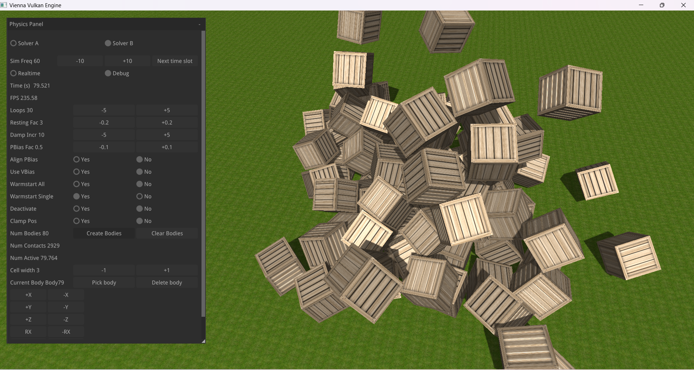
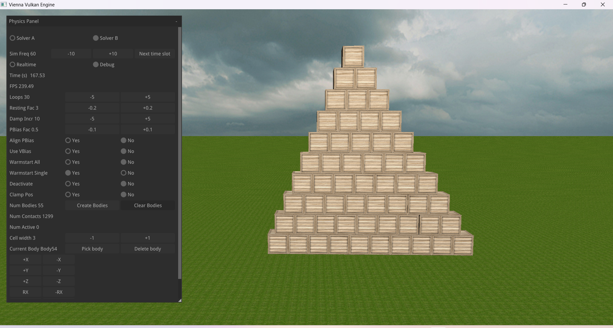

# The Vienna Physics Engine (VPE)
The Vienna Physics Engine (VPE) is a simple, single file physics engine for educational purposes.
Rendering can done by any render engine or framework. The example project provided in this repo uses the Vienna Vulkan Engine (https://github.com/hlavacs/ViennaVulkanEngine) for rendering.

The VPE is developed as basis for game based courses at the Faculty of Computer Science of the University of Vienna, held by Prof. Helmut Hlavacs:

- https://ufind.univie.ac.at/de/course.html?lv=052212&semester=2023W
- https://ufind.univie.ac.at/de/course.html?lv=052211&semester=2023S
- https://ufind.univie.ac.at/de/course.html?lv=052214&semester=2023S

VPE's main contributor is Prof. Helmut Hlavacs (http://entertain.univie.ac.at/~hlavacs/). The parts for general constraints have been implemented by Julian Schneebaur. The softbody simulation was implemented by Felix Neumann.

VPE features are:
- C++20
- Full rigid body simulation, for now for polytopes only
- Sequential impulse based solver
- Implements two solvers to choose from
- Friction
- Contact set reduction
- Warm starting for stable stacking
- Many joint constraints: ball-socket, hinge with angle limits, motor, slider with limits, fixed
- Combined models: bridge, drive train, rag doll

# Set up for Windows 11

The whole engine is contained in VPE.hpp. The provided example program uses the Vienna Vulkan Engine for rendering and is thus currently restricted to Windows 11. If you want to compile the example, do the following steps:
- Make sure you have an up to date CMake, MS Visual Studio 22 and the Vulkan SDK installed.
- Clone both projects Vienna Vulkan Engine and Vienna Physics Engine, into the same directory, next to each other.
- Cd into Vienna Vulkan Engine and run CMake. Alternatively run the msvc bat file. CMake creates an sln project file.
- Open the sln file and compile the project. Sometimes compile it twice to make sure everything is done correctly.
- You might also manually compile the doxyfile subproject to create the documentation. For this you must have Doxygen installed.
- Cd into the Vienna Physics Engine directory and run CMake (or the msvc bat file).
- Open the sln file and compile the project.
- Note that the physicsexample.exe file is copied to the bin directory of the Vienna Vulkan Engine!
- Make sure that the physics example is the starting project.
- Now you can run the example.

For Windows 11, all non-Vulkan dependencies are in the external directory. The Vulkan SDK is supposed to be pointed at by the VULKAN_SDK environment variable.

The project will be updated regularly, so it makes sense to pull the newest version regularly.

# Using VPE

You can use VPE without the VVE, just include VPE.hpp into your project, its 100% C++20 and does not depend on any external library.
The main class is called VPEWorld. This class manages rigid bodies, which themselves must be polytopes, i.e., convex mesh like objects, consisting of faces, edges and vertices. There can be arbitrary numbers of VPEWorld instances at any time. You can create bodies, erase bodies, attach forces to bodies by calling the respective member functions addBody(), eraseBody(), attachForce(). See the examples in physicsexample.cpp.

When created, you can specify a plethora of parameters, like polytope type, mass, velocity, rotation, friction etc. See the constructor of the class Body for more details.
You can also specify two callbacks. One is called when the body moves, so your render engine can update its position and orientation. The other is called if the body is erased by calling eraseBody() or clear(). This way, its pendent in the render engine can be automatically removed as well.
See the functions onMove() ad onErase() in physicsexample.cpp.

The pendent in your render engine is called the owner of the body, and a pointer to it is stored as void pointer with the body. There is a 1:1 correspondence between the owner and a body. An owner can not own more than one body. The void pointer to the owner is the key that is used in the associative container m_bodies to store all bodies and can be used to find using getBody() it or erase it later using eraseBody().
The pointer VPEWorld::m_body always points the latest body created, or a body that was picked with the debug panel option "pick body".

The simulation is advanced by dt seconds calling tick(dt). See how the debug panel works for more options.

# The Debug Panel

physicsexample.cpp contains code that uses Nuklear to create two debug panels, for plan rigid body simulation and body constraints. The rigid body panel lets you monitor and change many values of the simulation. This is done simply by changing the respective member variables of the VPEWorld instance.

In debug mode, the simulation pauses and can be stepped through manually. This can be mixed with debugging and setting breakpoints, and outputting values.

# Screenshots and Videos

Video

Random objects falling from above.

Pyramid.

Destroying the pyramid.

Arbitrarily high stack.

## Links
-	https://github.com/hlavacs/ViennaVulkanEngine
