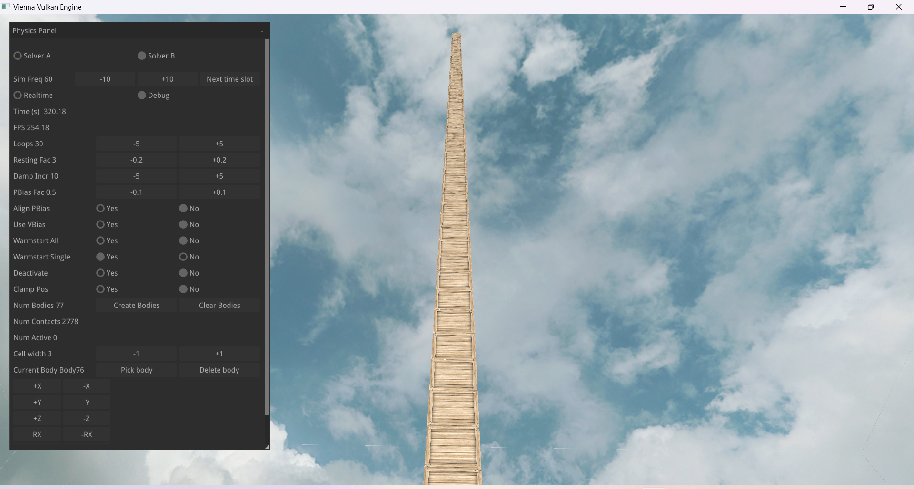

# The Vienna Physics Engine (VPE)
The Vienna Physics Engine (VPE) is a simple, single file physics engine for educational purposes.
Rendering is done by the Vienna Vulkan Engine.

The VPE is developed as basis for game based courses at the Faculty of Computer Science of the University of Vienna, held by Prof. Helmut Hlavacs:

- https://ufind.univie.ac.at/de/course.html?lv=052214&semester=2019W
- https://ufind.univie.ac.at/de/course.html?lv=052212&semester=2019W
- https://ufind.univie.ac.at/de/course.html?lv=052211&semester=2019S

VPE's main contributor is Prof. Helmut Hlavacs (http://entertain.univie.ac.at/~hlavacs/). However, VPE will be heavily involved in the aforementioned courses, and other courses as well.

VPE features are:
- C++20
- Polytopes only
- Sequential impulse based
- Implements two solvers to choose from
- Friction
- Contact set reduction
- Warm starting, stable stacking

# Set up for Windows 10

The whole engine is contained in VPE.hpp. Clone the project, open the .sln file, compile, run.
For Windows 11, all non-Vulkan dependencies are in the external directory. The Vulkan SDK is supposed to be pointed at by the VULKAN_SDK environment variable.

The project will be updated regularly, so it makes sense to download the source files once in a while, or clone the whole project. Make sure to keep your main.cpp or other files that you created.

# Using VPE

You can use VPE without the VVE, just include VPE.hpp into your project, its 100% C++20 and does not depend on any external library.
The main class is called VPEWorld. This class manages bodies, which themselves must be polytopes, i.e., convex mesh like objects, consisting of faces, edges and vertexes. There can be arbitrary numbers of VPEWorld instances at any time. You can create bodies, erase bodies, attach forces to bodies by calling the respective member functions addBody(), eraseBody(), attachForce(). See the examples in main.cpp.

When created, you can specify a plethora of parameters, like polytope type, mass, velocity, rotation, friction etc. See the constructor of the class Body for more details.
You can also specify two callbacks. One is called when the body moves, so your render engine can update its position and orientation. The other is called if the body is erased by calling eraseBody() or clear(). This way, its pendent in the render engine can be automatically removed as well.
See the functions onMOve() ad onErase() in main.cpp.
The pendent in your render engine is called the owner of the body, and a pointer to it is stored as void pointer with the body. There is a 1:1 correspondence between the owner and a body. An owner can not own more than one body. The void pointer to the owner is the key that is used in the associative container m_bodies to store all bodies and can be used to find using getBody() it or erase it later using eraseBody().
The pointer VPEWorld::m_body always points the latest body created, or a body that was picked with the debug panel option "pick body".

The simulation is advanced by dt seconds calling tick(dt). See how the debug panel works for more options.

# The Debug Panel

Main.cpp contains code that uses Nuklear to create a debug panel. This panel lets to monitor and change many values of the simulation. This is done simply by changing the respective member variables of the VPEWorld instance.

In debug mode, the simulation pauses and can be stepped through manually. This can be mixed with debugging and setting breakpoints, and outputting values.

# Screenshots and Videos

Video

Random objects falling from above.

Pyramid.

Destroying the pyramid.

Arbitrarily high stack.

## Links
-	https://github.com/hlavacs/ViennaVulkanEngine
